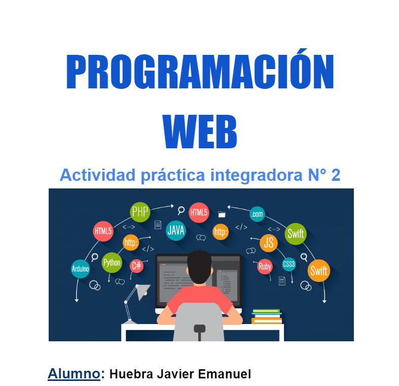

# MI_PROYECTO
Proyecto para materia Programación Web de <a href="https://www.teclab.edu.ar/">instituto TECLAB</a>
## 💻 Tecnologías utilizadas:
    
 

<a href="https://drive.google.com/file/d/1tgmHo3C_tU4ZwqXIH0L-f3_8R3eL8fED/view?usp=sharing"> #VER ACTIVIDAD 1</a>
 
<a href="https://drive.google.com/file/d/16g38wzA8Htz1KAso53TMbG1kxJ3Te2Lb/view?usp=sharing"> #VER ACTIVIDAD 2</a>
 
 
ACTIVIDAD 3....(Pending)
 
 
ACTIVIDAD 4....(Pending)

